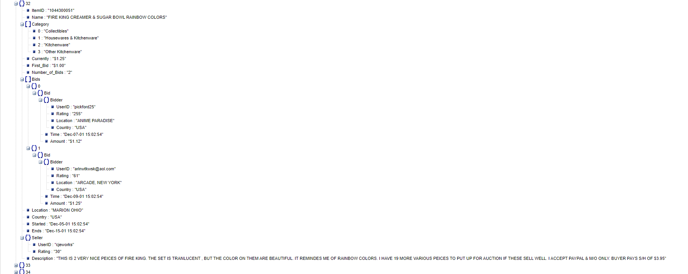
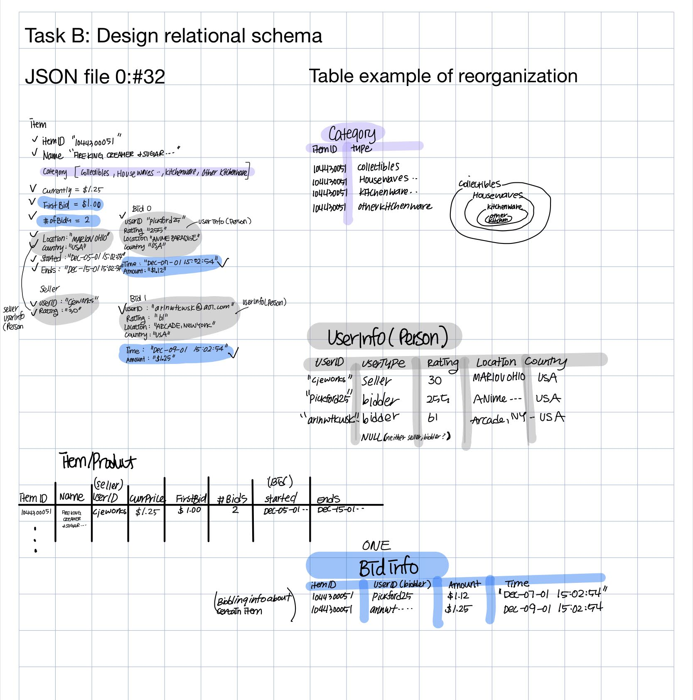
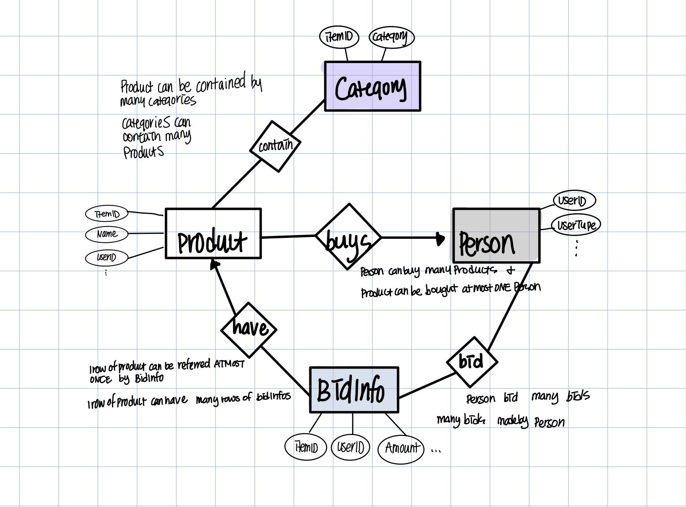

# Task D
## Task A: Examine the Json Data File
paste bay_data/items-0.json file at http://jsonviewer.stack.hu/

## Task B: Design your relational schema
Come up with a better schema design

TODO: create a file design.pdf of 
1. relational schema definitions in text form 

2. entity relation diagram

